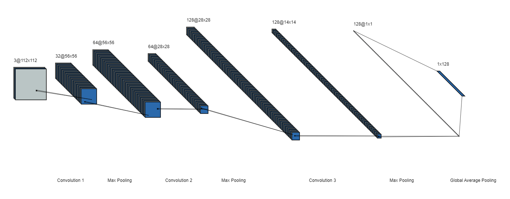

# Data Analytics 2 - Face Verification Case Study 

## 1. Background and Task Description
This project is based on a case study as part of the course Data Analytics 2 in the Master of Information Systems at the 
University of Muenster. The main task is to build an application for face verification. This project is restricted by the 
maximum number 200.000 trainable parameters in the model. In general, face verification has a broad field of applications 
e.g (smartphone, airport etc.) and is therefore an important field of research. 

## 2. Selected Model and Source Data
To fulfill this task we selected a Siamese Convolutional Neural Network (CNN), which is suited for face verification/recognition tasks.
During our project, we implemented a Siamese CNN with two loss functions. The first loss function is the Contrastive Loss and the 
second Loss function is the Triplet Loss. Our selected Machine Learning Framework is PyTorch. As training data we used 
synthetic generated images, which are described in more detail in this paper: https://openaccess.thecvf.com/content/ICCV2021/papers/Qiu_SynFace_Face_Recognition_With_Synthetic_Data_ICCV_2021_paper.pdf

## 3. Architecture 
Our architecture consists of ~109.000 trainable Parameters. An overview about the individual layers can be found below:


## 4. Folder Structure
```
└───src
    ├───base
    │   ├───1_DataAugmentation
    │   ├───2_Training
    │   ├───3_Tuning
    │   ├───4_Evaluation
    │   └───5_TrainedModels
    │       ├───ContrastiveLoss
    │       │   ├───Augmented
    │       │   └───NotAugmented
    │       └───TripletLoss
    └───statistics
        ├───1_Architecture
        ├───2_Training
        └───3_Evaluation
            ├───ContrastiveLoss
            └───TripletLoss
```

### 4.1 Data Augmentation
This folder contains the code to augment the given synthetic generated images. 
This code is intended to run locally due to problems with Google Colab and Google Drive,
while running this program. In order to augment and use your augmented images you can follow this
procedure: 

1. Run PreProcessing.py locally on your laptop e.g with PyCharm 
2. Convert the folder that contains the augmented images into a .zip file
3. Upload this zip-file into your Google Drive environment 
4. Copy and unzip the uploaded zip-file into your Google Colab runtime environment 

### 4.2 Training
This folder contains one JupyterNotebook that can be used to train out Siamese Neural Network.
You have the possibility to use either the contrastive- or the triplet loss function. Note here 
that for the triplet loss function pytorch_metric_learning is used, while for the contrastive loss 
the elements (e.g loss function and dataloader) are implemented manually. More detailed instruction how to use 
our code can be found in the JupyterNotebook. 

### 4.3 Hyperparameter Tuning
Hyperparameter Tuning was conducted with the Optuna Library. The overall result did not contribute to a 
significant increase of the model performance. Furthermore, the notebook contains still deprecated methods, which were
not used in the training. Due to limited computing resources, we did not spend further time with the Hyperparameter Tuning.
But in general we think that this is an important step to improve the overall model performance.

### 4.4 Evaluation 
The Evaluation.py file can either take a stored model or the stored model weights as .pth file. During the evaluation procedure 
the given model is evaluated based on the pair.txt file and the lfw_cropped dataset as testing dataset. 

### 4.5 Trained Models 
In this folder our trained models can be found. 

### 4.6 Statistics 
In this folder all types of statistics can be found, that were created during our project. The folder is split into 
three subfolder with statistics for the architecture, the training process and the evaluation process.

## 5. Pre-Requisites 
You need an IDE for running Python code and a Google Colab account. Apart from that all libraries mentioned in the
requirements.txt file need to be installed. You can do this by typing the following command into your command line.
```
pip install -r requirements.txt 
```
All needed libraries except of pytorch_metric_learning are installed by default on Google Colab. As a Python version Python 3.12 was used.

## 6. Poster 


## 7. Contributors 
- Dimitrij Eli 
- Kevin Martin Schulz 
- Marc David Sutjipto 
- Tobias Martin Künzel 
- Piet Vinnbruck 


